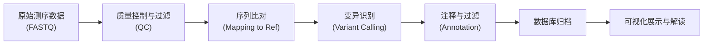

#  DNA 组学概述

DNA 组学（Genomics），通常泛指以基因组学为核心的高通量测序技术与分析体系。它涵盖了全基因组测序（WGS）、群体转录组测序（Bulk RNA-seq）以及宏基因组学（Metagenomics）等，旨在全面解析生物体的遗传信息与表达图谱。
根据底层测序原理的不同，目前主要分为**短读长测序（Short-read sequencing）**和**长读长测序（Long-read sequencing）**两大技术阵营。

## 定义

DNA 组学及其衍生领域的重点研究方向包括：
- **基因组结构与变异**：完整基因组序列的破译，以及单核苷酸多态性（SNP）、插入缺失（InDel）、拷贝数变异（CNV）和结构变异（SV）的鉴定，探讨物种进化与系统发育。
- **转录表达与调控**：基因转录表达水平的动态变化及其可变剪接等分子机制。
- **微生态与宏基因组**：环境或宿主微生物群落的物种组成、丰度差异及功能基因群的表达水平。
- **表观遗传修饰**：DNA 甲基化、组蛋白修饰等不改变底层序列但影响基因表达的遗传调控机制。

## 主要应用技术

| 技术 | 主要应用 | 优势 | 局限 |
|------|------|------|------|
| **全基因组测序（WGS）** | 完整基因组序列与全面变异检测 | 无目标区域捕获偏差，信息最全面 | 测序成本相对较高，数据分析与存储压力大 |
| **全外显子测序（WES）** | 蛋白质编码区变异检测 | 成本效益高，聚焦核心功能区 | 漏检内含子及基因间区的调控变异 |
| **转录组测序（RNA-seq）**| 基因表达定量与转录本分析 | 动态反映细胞/组织特定生理状态 | 依赖样本 RNA 质量（易降解），受时空特异性限制 |
| **宏基因组测序（Metagenomics）** | 复杂环境微生物群落与功能分析 | 无需微生物纯培养，直接获取总体遗传信息 | 易受宿主核酸污染干扰，低丰度物种组装困难 |
| **甲基化测序（WGBS/RRBS）** | DNA 表观遗传修饰图谱绘制 | 高分辨率（如 WGBS 达单碱基级），揭示调控机制 | 亚硫酸氢盐处理易导致 DNA 损伤，文库构建难度高 |

## 主要测序技术平台

| 分类 | 厂家 | 核心技术平台/代表机型 | 技术原理 | 优势 | 局限 |
|------|------|------|------|------|------|
| **短读长** | **华大智造 (MGI)** | DNBSEQ 系列 (如 T7, G400) | DNA 纳米球 (DNB) 结合联合探针锚定聚合技术 (cPAS) | 扩增错误率极低，Index 串扰小，性价比极高 | 读长受限，难以跨越极其复杂的高重复序列区域 |
| **短读长** | **因美纳 (Illumina)** | NovaSeq, NextSeq 系列 | 桥式 PCR 扩增与边合成边测序 (SBS) | 市场生态完善，短读长数据准确度高 | 存在潜在的 PCR 扩增偏好性与测序偏倚 |
| **长读长** | **华大序风 (Cyclonseq)** | 序风系列单分子测序仪 | 纳米孔单分子测序技术 | 国产自主可控，超长读长，设备具备小型便携潜力 | 单碱基准确率仍在持续优化中 |
| **长读长** | **牛津纳米孔 (ONT)** | PromethION, MinION 系列 | 蛋白质纳米孔测序 (实时电信号监测) | 读长极长 (可达 Mb 级)，实时输出数据，可直接检测甲基化修饰 | 原始单碱基错误率较高 (尤其是同聚物区域) |
| **长读长** | **PacBio** | Revio, Sequel 系列 | 单分子实时测序 (SMRT) / HiFi 模式 | HiFi 模式兼具长读长与极高准确率 (`>99.9%) | 测序试剂成本相对较高，整体通量不及主流短读长平台 |

## 数据类型

### 原始数据
- **FASTQ 格式**：包含测序碱基序列及对应质量值（Q-score）的原始数据文件。
- **质控报告**：如 FastQC 或 SOAPnuke 生成的质量控制评估指标。

### 比对数据
- **BAM/CRAM 格式**：原始 reads 比对到参考基因组后的二进制对齐文件。
- **比对统计信息**：覆盖度（Coverage）、深度（Depth）、比对率等。

### 变异数据
- **VCF 格式**：用于存储 SNP、InDel 等基因组变异信息及其注释打分。
- **表达矩阵 (Count Matrix)**：转录组或宏基因组分析中产生的基因/物种丰度定量表格。

## 分析流程

## 数据库资源
- **CNGBdb**：CNGBdb是一个为科研和产业工作者提供生物大数据共享和应用服务的统一门户，基于大数据、云计算和 AI 技术，提供数据归档、计算分析、知识搜索、数据库开发和托管、生物信息与数据库工程师培训等服务。
- **ClinVar**：人类变异与表型/疾病相关性的临床公共归档数据库。
- **dbSNP**：包含各种物种单核苷酸多态性及短插入缺失的综合数据库。
- **COSMIC**：全球最大、最全面的体细胞突变及癌症相关变异数据库。
- **gnomAD**：跨人群的大规模外显子组和基因组变异频率参照图谱。
- **GEO / SRA**：NCBI 旗下这里是为您精心润色和完善后的 `overview.md` 文件内容。

---

继续学习 [实验方法](methods) 或查看 [数据分析](analysis)。
